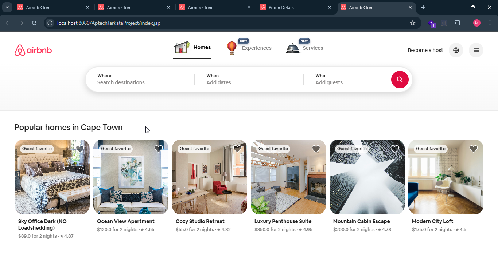
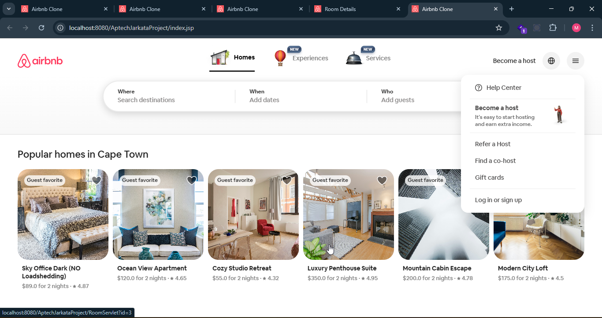
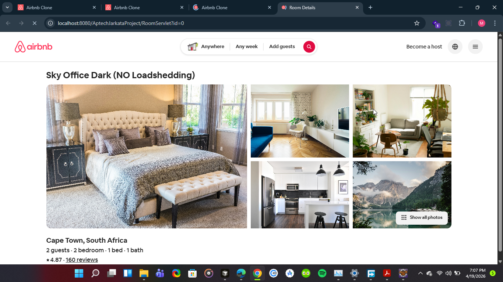
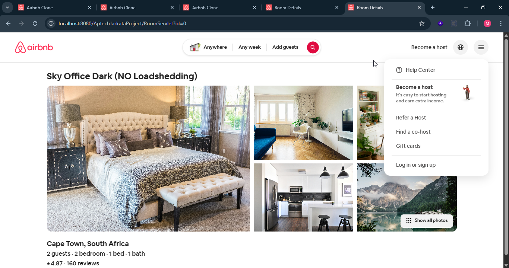

# Simple Airbnb Clone

A simple Airbnb-inspired web app built with Java, JSP, Servlets, JSTL, HTML, CSS, and vanilla JavaScript. The project showcases a homepage with room cards, a room detail page, and a working dropdown menu in the header.


## Features

- Airbnb-style homepage with a header, search bar, and listing cards
- Room detail page with a larger image gallery and property details
- Working dropdown menu in the top-right header
- Tab switching in the header between Homes, Experiences, and Services
- In-memory room data for easy demo use without a database
- External image loading from Unsplash for listing photos

## Screenshots

The screenshots in the project root are included below for quick preview.

### Homepage



### Homepage with dropdown open

This is the same homepage view, just with the header dropdown menu expanded to show that it works.



### Room details page



### Room details page with dropdown open

This is the same room details page, just with the dropdown menu open.



## Tech Stack

- Java 21
- Jakarta Servlet API
- JSP
- JSTL
- HTML5
- CSS3
- Vanilla JavaScript
- Apache Tomcat 10.1

## Project Structure

```text
src/
  main/
    java/
      data/
        RoomData.java
      model/
        Room.java
      servlet/
        RoomServlet.java
    webapp/
      header.jsp
      index.jsp
      room.jsp
      script.js
      style.css
      favicon.png
      WEB-INF/lib/
```

## How It Works

- `RoomData` stores a list of sample rooms directly in memory.
- `RoomServlet` loads either all rooms for the homepage or a single room for the details page.
- `index.jsp` renders the listing cards.
- `room.jsp` renders the selected property with a larger image gallery.
- `header.jsp` contains the shared Airbnb-style header and dropdown menu.
- `script.js` handles the tab selection and dropdown toggle behavior.

## Getting Started

### Prerequisites

- Java 21
- Apache Tomcat 10.1
- Eclipse IDE or any IDE that supports Dynamic Web Projects

### Run in Eclipse

1. Import the project as an existing Dynamic Web Project or standard Eclipse web project.
2. Make sure the project is configured to use Java 21.
3. Add and configure Apache Tomcat 10.1 in your IDE.
4. Deploy the project to Tomcat.
5. Open the app in your browser and visit `RoomServlet` for the homepage or `RoomServlet?id=0` for a sample room detail page.

### Useful Routes

- Homepage: `/RoomServlet`
- Room details: `/RoomServlet?id=0`

## Notes

- This is a front-end focused demo with hardcoded sample data.
- The listing images are loaded from external Unsplash URLs.
- The dropdown screenshots are included only to demonstrate that the same dropdown works on both pages.

## License

No license has been added yet.

## Author

Maduka JP
